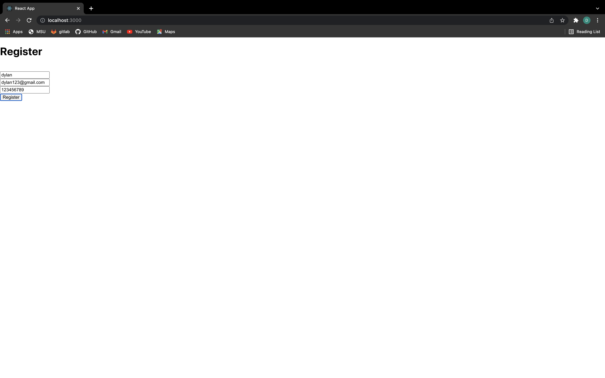
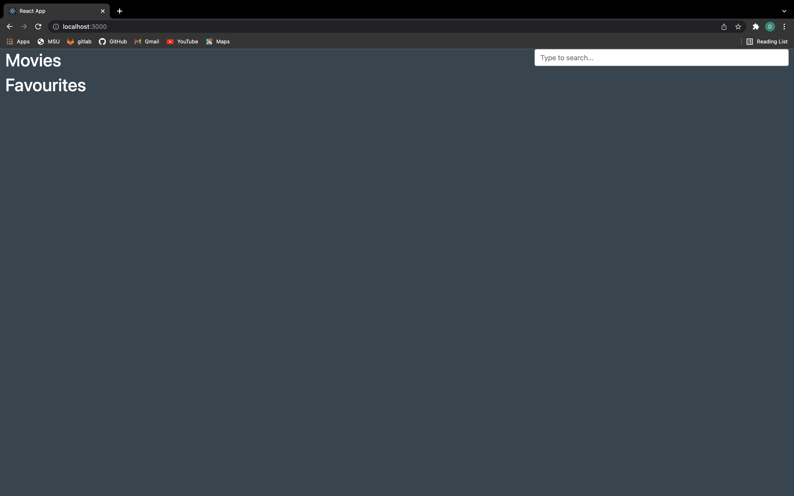

# Movie Watchlist
  ## Table of Contents
  * [Project Description](#project-description)
  * [Installation](#installation)
  * [Usage](#usage)
  * [License](#license)
  * [Contributing](#contributing)
  ## Project Description
  A movie watchlist built using mern stack (MongoDB, Express, React, Node) to make a profile to add movies to your favorite and explore new movies.
  ## Installation
  npm install
  ## Usage
  npm start
  ## License
  This project is under MIT for licensing.
  
  ## Contributing
  Feel free to submit code
  ## Website

  
  
  
  ## Questions
  please feel free to ask me any questions.
  Github username: Dylanbitto, Ivanicus18, coltonward07
  